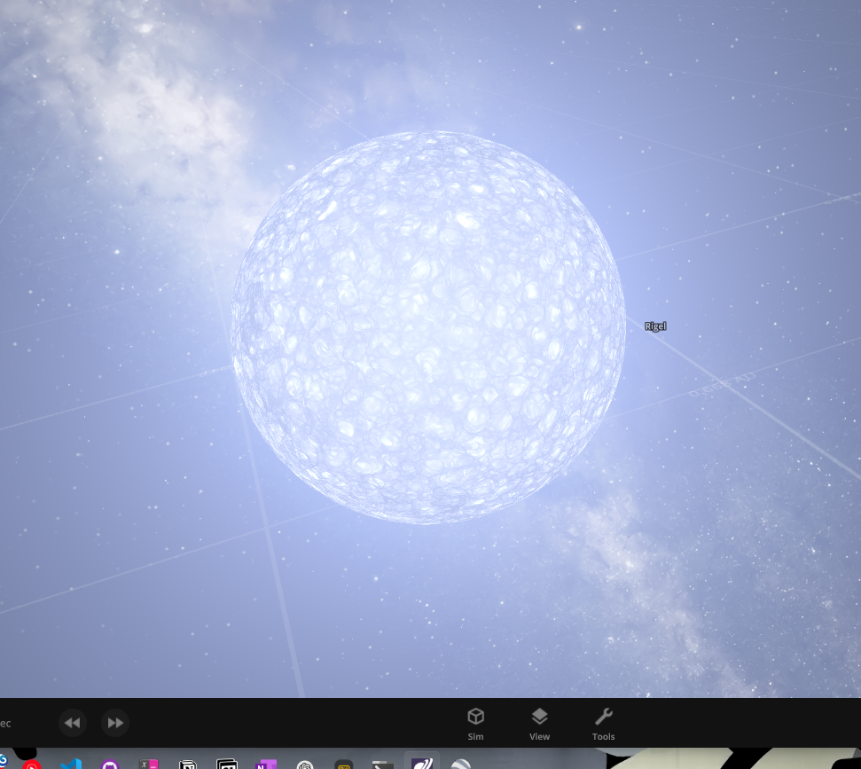
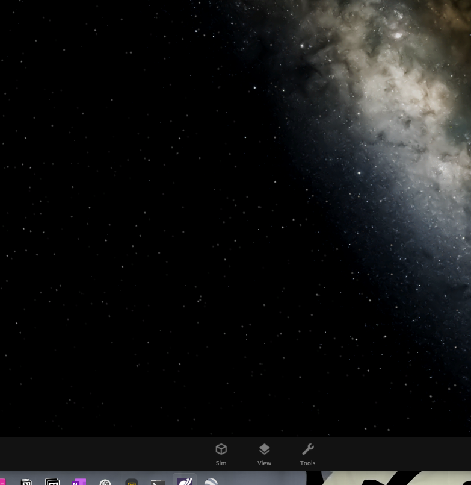
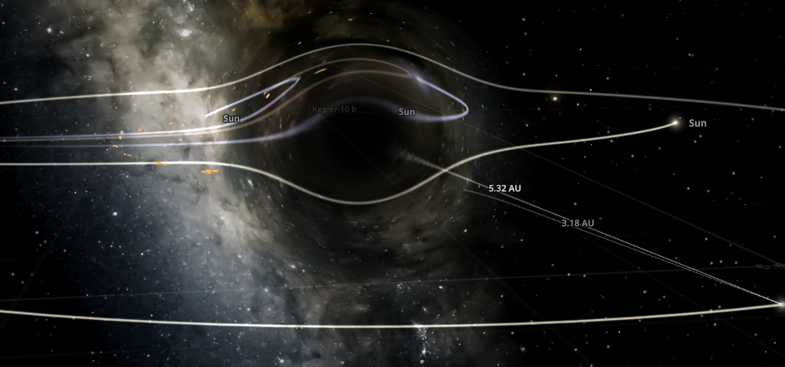
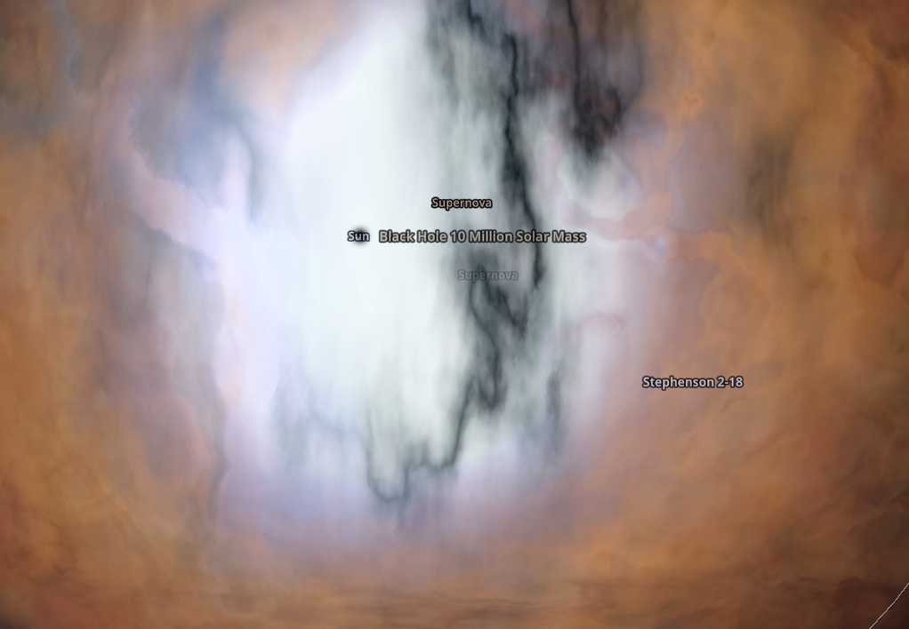
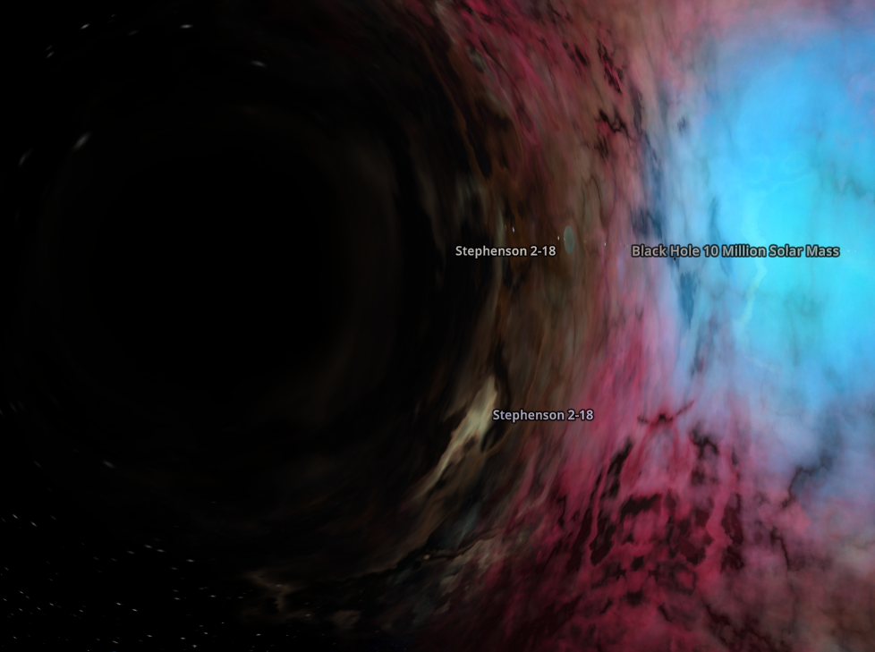

# Schwarzschild Radius

> Testing can be done in universe sandbox 2

$$R_{s}=\frac{2GM}{c^2}$$

With $G$ being the gravitational constant (around $6.67\times10^{-11}$).

$M$ being the mass of the object.

$c$ being the speed of light / speed of causality (cause => effect).

$c$ can be $\approx 299'000'000\frac{m}{s}$. (https://en.wikipedia.org/wiki/Speed_of_light)

## Rigel's $R_s$

First, create a new sim, then load rigel into it:

Next, run `./run.sh rigel`, and you'll soon see that the result for rigel is around the $\approx 53'000$ mark, so decrease it's radius to that.

wait.. where did it go?

Now, it has become a black hole, and you cannot see it easily with the naked eye anymore. that's why even the best telescopes have a hard time detecting new black holes, due to **nothing** escaping it's event horizon.

Another reason is that is **does not** have an accretion disk yet. since there are no other stars in our simulation, the dead rigel still bends spacetime to an extreme degree, but since nothing is in it's proximity, "nothing" gets pulled into it with it's sheer gravitational pull.

But if we spawn a larger black hole from the tools section and put a couple stars next to it, you can see it starting to form it's accretion disk from the left-overs of the suns:

although it's slow, it's steady!

Something even funnier happens when you put the biggest known star (Stephenson 2-18) next to it:

A supernova explosion occurs!

Now honestly, I have no idea why that happened, but that means that the star was out of fuel, and wasn't able to fuse lighter nuclei like hydrogen nuclei into helium nuclei, since the hydrogen at its outer shell was all used up. and when it's out of that fuel, it explodes.

Look at this beautiful image, with the effects of gravitational lensing become ever clearer

